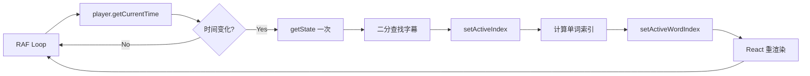

# LangPlayer 架构文档

## 📁 项目结构

```
src/
├── components/          # React 组件
│   ├── SimplePlayer.tsx        # 播放器组件（YouTube/本地视频）
│   ├── SubtitleOverlay.tsx     # 字幕覆盖层（内嵌字幕列表）
│   ├── SubtitleControls.tsx    # 字幕控制栏
│   ├── OptimizedWord.tsx       # 优化的单词高亮组件
│   ├── EvaluationModal.tsx     # 评分弹窗
│   └── AudioWaveform.tsx       # 音频波形图
│
├── views/              # Obsidian 视图
│   ├── LinguaFlowView.tsx      # 主播放器视图
│   └── SubtitlePanelView.tsx   # 独立字幕面板视图
│
├── hooks/              # 自定义 Hooks
│   ├── useMediaSync.ts         # 【核心】媒体同步 Hook（RAF）
│   ├── useRecordingSession.ts  # 录音会话管理
│   └── useAudioRecorder.ts     # 音频录制
│
├── store/              # 状态管理
│   └── mediaStore.ts           # 【核心】Zustand 全局状态
│
├── services/           # 业务逻辑
│   ├── SubtitleParser.ts       # 字幕解析（SRT/VTT）
│   ├── SubtitleLoader.ts       # 字幕加载（带缓存）
│   ├── OpenAIService.ts        # OpenAI API
│   ├── AzurePronunciationService.ts  # Azure 语音评分
│   └── YouTubeDLService.ts     # YouTube 元数据获取
│
├── utils/              # 工具函数
│   ├── logger.ts               # 【新增】日志系统
│   └── fileUtils.ts            # 文件工具
│
├── settings.ts         # 插件设置
├── main.ts            # 【入口】插件主类
└── types.ts           # TypeScript 类型定义
```

---

## 🔄 关键数据流

### 1. 播放器启动流程

```
用户点击播放
    ↓
LinguaFlowView.loadMedia()
    ↓
SimplePlayer 渲染（YouTube/Video）
    ↓
playerRef.current 赋值
    ↓
useMediaSync 启动 RAF 循环（60fps）
    ↓
每帧：getCurrentTime() → findIndexAtTime() → setActiveIndex()
    ↓
SubtitleOverlay 接收 activeIndex 更新
    ↓
滚动到激活字幕 + 高亮单词
```

### 2. 字幕同步关键路径



**性能关键点：**
- ⚡ **RAF 优化**：每帧 ~16ms，避免重复计算
- ⚡ **Store 访问**：一次 `getState()` 获取所有状态（已优化）
- ⚡ **二分查找**：O(log n) 定位字幕
- ⚡ **节流更新**：~10fps 更新 React Store（减少重渲染）

### 3. 录音评分流程

```
用户点击录音按钮
    ↓
useRecordingSession.startRecording()
    ↓
useAudioRecorder.start()
    ├→ 获取麦克风权限
    └→ 启动 MediaRecorder
    ↓
录音中（显示波形）
    ↓
用户点击停止
    ↓
useAudioRecorder.stop() → 返回 Blob
    ↓
OpenAIService.transcribe() → 转录文本
    ↓
AzurePronunciationService.assess() → 评分
    ↓
EvaluationModal 显示结果
```

---

## ⚡ 性能优化策略

### 1. RAF 循环优化（已完成）
- ✅ 一次性获取 state，避免每帧多次 `getState()`
- ✅ 时间变化检测（< 0.01s 跳过）
- ✅ Store 更新节流（100ms）

### 2. React 渲染优化
- ✅ `React.memo` 包装组件
- ✅ 直接 DOM 操作（`OptimizedWord`）
- ✅ 单词缓存（避免每帧 `split()`）

### 3. 内存管理（已完成）
- ✅ useEffect 清理函数
- ✅ RAF 取消（`cancelAnimationFrame`）
- ✅ 定时器清理（`clearInterval/clearTimeout`）

### 4. 文本处理优化
- ✅ `TextProcessor.cache`（500条缓存）
- ✅ 预解析单词（加载时而非播放时）

---

## 🔑 关键 API

### mediaStore (Zustand)

**状态**
```typescript
{
  currentTime: number;        // 当前播放时间
  playing: boolean;           // 播放状态
  subtitles: SubtitleCue[];   // 字幕数组
  activeIndex: number;        // 当前激活字幕索引
  activeWordIndex: number;    // 当前激活单词索引
  // ... 更多状态
}
```

**关键方法**
```typescript
setCurrentTime(time: number)       // 更新播放时间
setActiveIndex(index: number)      // 更新激活字幕
startSegmentLoop(...)              // 单句循环
playNextSegment()                  // 播放下一句
playPreviousSegment()              // 播放上一句
```

### useMediaSync Hook

**职责**
- 每帧同步播放器时间到 Store
- 二分查找当前字幕
- 计算单词级高亮
- 处理循环播放（AB 复读、单句循环）
- 影子跟读逻辑

**性能**
- 60fps（~16ms/帧）
- 优化后每帧开销 < 1ms（正常播放）

### SubtitleParser

**支持格式**
- SRT（SubRip）
- VTT（WebVTT）

**关键方法**
```typescript
parse(content: string): SubtitleCue[]
findIndexAtTime(subtitles, time, hint): number  // O(log n)
```

---

## 🐛 常见问题排查

### 字幕不同步
1. **检查**：DevTools Console 中是否有 RAF 循环日志
2. **检查**：`player.getCurrentTime()` 是否返回正确值
3. **检查**：字幕数组是否正确加载（`subtitles.length`）

### 内存泄漏
1. **检查**：组件卸载时是否有清理日志
2. **检查**：Chrome DevTools Memory → Take Snapshot
3. **检查**：是否有未清理的定时器/监听器

### 性能问题
1. **开启调试模式**：设置 → 开发者 → 调试模式
2. **查看日志**：`[useMediaSync]` 日志频率
3. **使用 Performance API**：
   ```typescript
   logger.perfStart('operation');
   // ... code ...
   logger.perfEnd('operation');
   ```

---

## 🔧 调试技巧

### 1. 启用调试模式
```
设置 → LangPlayer → 开发者 → 调试模式 ✅
重新加载插件（Ctrl+R）
```

### 2. 查看关键日志
```javascript
// RAF 循环
[useMediaSync] Syncing...

// 字幕切换
[useMediaSync] Active index: 5 → 6

// Store 更新
[MediaStore] Active index changed

// 内存清理
[useMediaSync] Cleaning up sync loop
[useAudioRecorder] Component unmounting
```

### 3. 性能分析
```javascript
// 开发者工具 → Performance → 录制
// 查看 RAF 循环帧率和耗时
```

---

## 📚 技术栈

| 技术 | 用途 |
|------|------|
| **React** | UI 框架 |
| **Zustand** | 状态管理 |
| **TypeScript** | 类型安全 |
| **RAF** | 60fps 同步 |
| **MediaRecorder** | 音频录制 |
| **OpenAI API** | 语音转文字 |
| **Azure Speech** | 发音评分 |

---

## 🚀 扩展点

### 添加新的播放器类型
1. 在 `SimplePlayer.tsx` 中添加新的 case
2. 实现 `PlayerRef` 接口方法
3. 更新 `types.ts` 中的 `MediaSource` 类型

### 添加新的字幕格式
1. 在 `SubtitleParser.ts` 中添加解析逻辑
2. 更新 `parse()` 方法的格式检测
3. 确保返回 `SubtitleCue[]` 格式

### 添加新的语音服务
1. 在 `services/` 创建新服务类
2. 实现 `transcribe()` 和/或 `assess()` 方法
3. 在 `settings.ts` 中添加配置选项

---

**最后更新**：2024
**维护者**：LangPlayer Team
