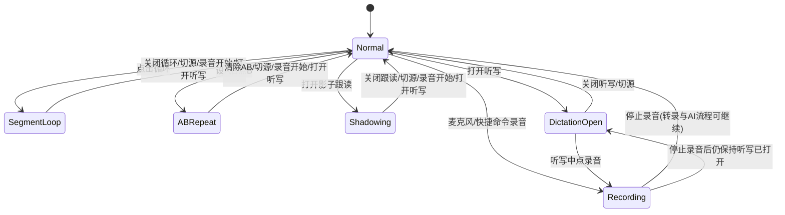
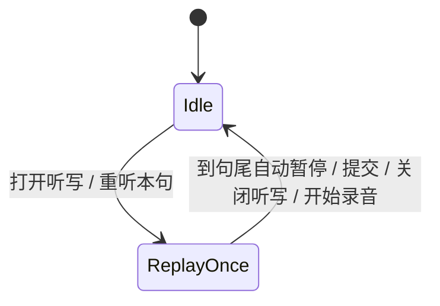
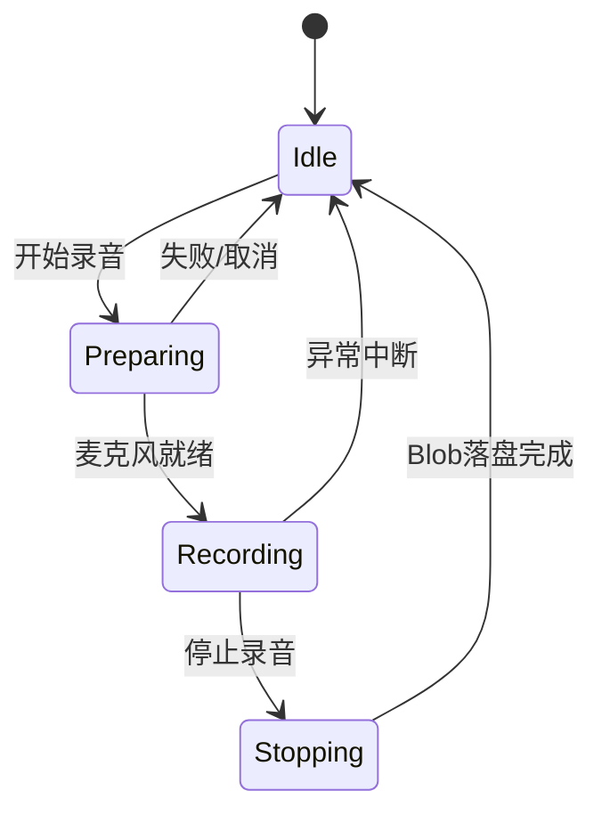

# LangFlow 播放器按钮互斥状态图（含边界场景）

## 1) 主状态机（播放控制层）

## 2) 听写重播子状态机

> 设计简化：重听始终为单次（once），不再有循环到提交模式。听写面板内嵌在字幕面板中，由字幕面板工具栏的听写按钮或播放器工具栏的听写图标切换。

## 3) 录音子状态机

## 4) 互斥规则矩阵（当前实现）

| 当前状态 | 循环按钮 | AB按钮 | 影子跟读 | 听写按钮 | 听写重播 | 录音按钮 |
|---|---|---|---|---|---|---|
| `Normal` | 可用 | 可用 | 可用 | 可用 | 仅听写面板内（始终单次） | 可用 |
| `SegmentLoop` | 可用(可关) | 可用(切AB会替换模式) | 可用(会替换模式) | 可用(进入听写会`exitMode`) | 仅听写内 | 可用(开始录音会`exitMode`) |
| `ABRepeat` | 可用(切循环会替换模式) | 可用(可清AB) | 可用(会替换模式) | 可用(进入听写会`exitMode`) | 仅听写内 | 可用(开始录音会`exitMode`) |
| `Shadowing` | 可用(会替换模式) | 可用(会替换模式) | 可用(可关) | 可用(进入听写会`exitMode`) | 仅听写内 | 可用(开始录音会`exitMode`) |
| `DictationOpen` | **可用**（音频后台循环本句直到答对） | 禁用 | 禁用 | 可用(可关) | 听写监视器让位给循环 | 可用 |
| `Recording(Preparing/Recording/Stopping)` | 禁用 | 禁用 | 禁用 | 禁用 | 禁用 | 可用(停止) |

## 5) 边界场景与期望行为

| 场景 | 期望 |
|---|---|
| 听写开启时，原来在循环/AB/跟读 | 立即 `exitMode`，避免双控制 |
| 听写开启时视频内字幕 | 自动隐藏；关闭听写后恢复原显示模式 |
| 听写中所有格子都对 | 350ms 绿色闪烁后自动前进到下一句并播放（若循环开启则在新句继续循环） |
| 听写中敲错字符 | 当前格变红、字符级累计 `failCount++`（同格 backspace 重写不重复计数） |
| 听写中敲对字符 | 格子下划线变绿，光标前进；所有格全对触发”完成”流程 |
| 同一句失败次数 ≥ `unlockShowAnswerAfter`（默认 5） | 出”我放弃了 — 显示答案 (Esc)”链接，点击/按 Esc 全格显示正确字符（蓝色），主按钮变”下一句” |
| 听写中开启单句循环 | 听写监视器只触发一次 phase 转 awaitInput 就退场，循环 store 接管音频；答对后短暂 `exitMode` + 暂停，新句重新装填时再 `enterMode` 复活循环 |
| 听写中开始录音 | 停止重播监视器，`exitMode`；录音停止后自动重新装填本句 |
| 录音开始前播放器在任意自动模式 | 统一 `exitMode`，录音独占 |
| 快捷命令录音 vs 麦克风按钮录音 | 两者走同一入口（`onMicClick`） |
| 听写输入框回车 | 默认提交核对；已解锁(`incorrectLocked`)时改为前进；`Shift+Enter` 换行 |
| 听写输入框Tab | 重听本句（不再是跳过） |
| 切换媒体源/卸载视图 | 清理 loop/recording 状态与定时器，防残留 |

## 6) 实现约束（代码级）

- 播放控制主状态：`useLoopStore.mode`（单一状态，天然互斥）
- 录音状态：`useRecordingStore.recorderState`
- 听写锁定条件：`dictationOpen || isRecordingBusy`
- 录音启动时强制：`useLoopStore.getState().exitMode()`
- 听写重播采用独立监视器，不复用 loop/shadow 状态
- 听写面板挂在字幕面板下方（条件渲染，由 `useDictationStore.dictationOpen` 控制），无独立 view
- 听写生命周期副作用（index lock、overlay 切换、自动播放）由 `DictationPanel` 自身的 mount/unmount effect 处理
