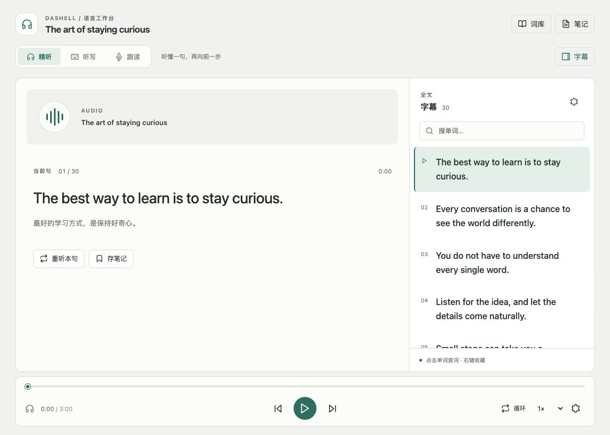
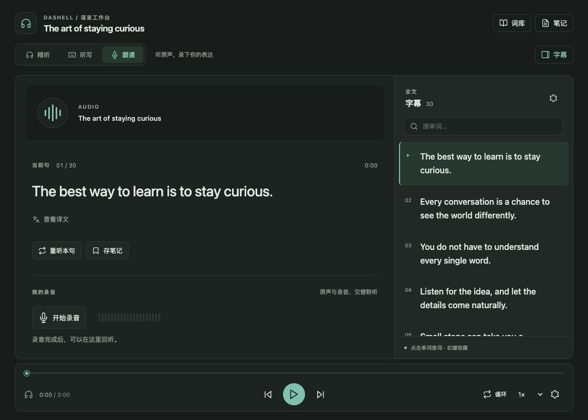

# Dashell Studio UI

播放器现在以一个工作台承载精听、听写和跟读：媒体区保持挂载，练习区随模式切换，全文作为可折叠的侧栏。窄分栏下改用“练习 / 全文”切换，底部保留公共播放控制。

- 精听：当前句、主动查看译文、单句重听、存入笔记。
- 听写：复用原有判定、错题、进度与快捷键；全文默认隐藏，句子导航折叠，字母提示支持点击。
- 跟读：复用真实录音服务，显示输入音量与录音回听。原声开始播放时停止录音回听。
- 全文：搜索、时间与语言显示、导入笔记、独立分栏入口保留；手动浏览后由“回到当前句”恢复跟随。
- 词库：虚拟列表搭配释义、原句、译文和来源回跳详情，保留编辑、删除撤销、状态、统计、导出与外部复习入口。
- 设置：常规、练习、字幕、词库、关于；字幕样式提供预览，分组导航支持键盘。

## 本地预览

运行 `npm run preview:ui`，打开 http://127.0.0.1:4173 。这是实际 React 组件与本地示例数据，非静态设计图。

- `/?dark`：深色工作台。
- `/?vocab`：词库；可与 `dark` 组合。
- `/?lang=en`：英文界面。

预览使用静音 WAV 和模拟宿主接口。文件选择、录音、笔记写入与第三方复习须在 Obsidian 内验证，不应将预览里的模拟操作视为真实持久化成功。脚本仅监听本机，生成文件放在 `/tmp/dashell-studio-preview`。

## 验证记录

- TypeScript 类型检查、生产构建通过。
- 22 个测试文件、105 项测试通过；新增测试确认保存失败时不会显示“已存入笔记”。
- 浏览器检查：1120px 桌面与 390px 窄栏，浅色、深色、听写隐藏全文、词汇详情、查找与跳句共存；390px 未出现页面横向溢出。
- 精听 → 跟读前后，媒体时间均为 14.601054 秒且 `readyState` 均为 4。
- 待宿主验收：真实视频、麦克风权限与录制、Vault 文件写入、第三方 Reader / Spaced Repetition 集成及 Obsidian 弹出窗口。

